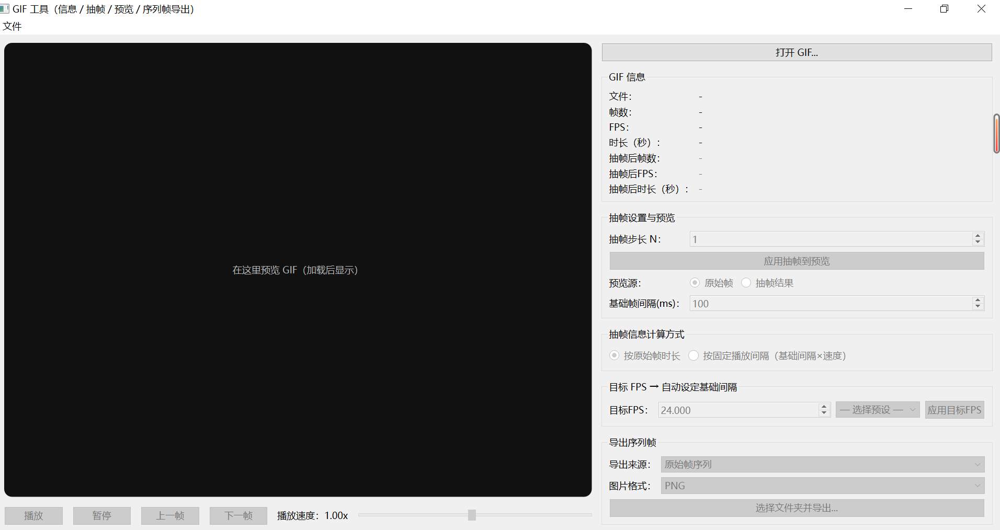

# GIF-Tool
# GIF 工具（信息 / 抽帧 / 预览 / 序列帧导出）

一个基于 **PySide6** + **Pillow** + **imageio** 的桌面工具，支持：
- 读取 GIF 基本信息（帧数、FPS、时长）
- 对 GIF 进行抽帧（按步长）
- 预览原始或抽帧结果
- 两种抽帧信息计算方式（按原始帧时长 / 按固定播放间隔）
- 目标 FPS 自动反推基础间隔
- 将 GIF 保存为序列帧图片（PNG/JPEG）

## 🖼 界面预览


## ✨ 功能特性

1. **获取 GIF 信息**
   - 帧数
   - FPS（每秒帧数）
   - 总时长（秒）

2. **抽帧与预览**
   - 按步长抽帧（每 N 帧取 1 帧）
   - 支持原始/抽帧预览切换
   - 播放/暂停/逐帧切换
   - 播放速度调节（0.05x~2.00x）
   - 基础帧间隔可调（单位 ms）

3. **抽帧信息计算模式**
   - 按原始帧时长（保留帧的原始 duration）
   - 按固定播放间隔（基础间隔 × 播放速度）

4. **目标 FPS 功能**
   - 输入目标 FPS 或选择预设（12/24/30/60）
   - 一键反推基础帧间隔

5. **导出功能**
   - 导出原始帧序列
   - 导出抽帧结果帧序列
   - 格式支持 PNG / JPEG（自动处理透明通道）

---

## 📦 安装依赖

建议使用虚拟环境：
```bash
python -m venv .venv
.venv\Scripts\activate  # Windows
source .venv/bin/activate  # macOS/Linux

pip install --upgrade pip
pip install PySide6 Pillow imageio

